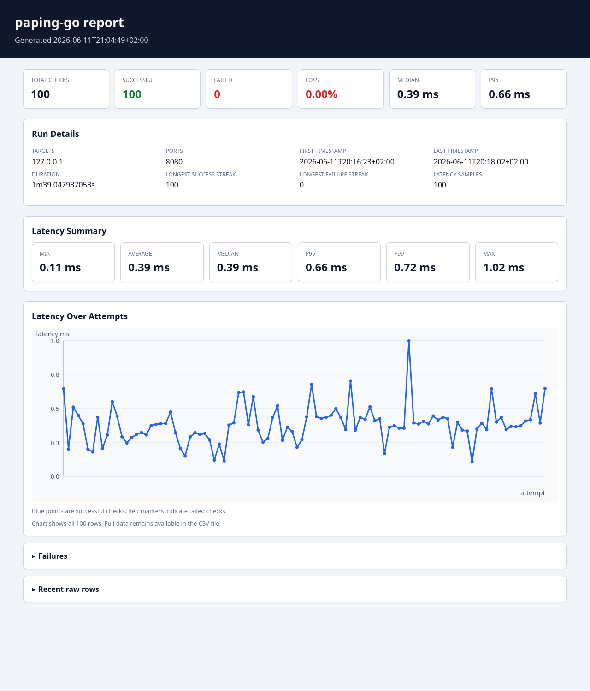

# paping-go

[](https://github.com/basecubedev/paping-go/actions/workflows/ci.yml)
[](https://github.com/basecubedev/paping-go/actions/workflows/build.yml)


Modern Go rewrite inspired by paping.

## Overview

paping-go is an independent Go rewrite inspired by the original `paping` tool by Mike Lovell.

This project is not a fork and does not include original paping source code.

It performs ping-like TCP port reachability checks and reports connection timing, making it useful when ICMP ping is blocked or when the service-level TCP path matters more than host reachability.

## Features

- TCP port reachability checks
- Ping-like repeated connection attempts
- Latency/timing output
- Count-based runs
- Duration-based runs
- Configurable interval/rate
- IPv4 / IPv6 selection
- Optional colored output
- CSV output for later analysis
- Built-in HTML report generation from CSV
- Simple standalone HTML viewer for manual CSV inspection
- Cross-platform builds for Linux, Windows and macOS

## Installation

Build from source:

```bash
go build -o paping-go .
```

Install with Go:

```bash
go install github.com/basecubedev/paping-go@latest
```

Once releases are published, most users should download prebuilt binaries from GitHub Releases.

## Usage

```bash
paping-go -p 443 example.com
```

Flags use Go's standard `flag` parser. Put options before the destination host:

```bash
paping-go -p 443 -c 5 -t 1000 example.com
```

Options:

```text
Usage:
  paping-go [options] <host>
  paping-go report <csv-file> -o <report.html>

Examples:
  paping-go -p 443 -c 5 example.com
  paping-go -p 443 -c 100 -o results.csv example.com
  paping-go report results.csv -o report.html

  -p N        TCP port (required)
  -c N        number of checks (-1 = infinite, default: -1)
  -d DURATION run for duration; cannot be combined with -c
  -r N        requests per second (default: 1, e.g. 0.5, 2, 10)
  -t N        timeout in milliseconds (default: 1000)
  -4          force IPv4
  -6          force IPv6
  -o FILE     write results to CSV file
  -nocolor    disable color output
  -version    print version and exit
```

Use either `-c` or `-d` to limit a run. `-c -1` enables continuous mode, `-c 0` is invalid, and `-c` and `-d` cannot be used together.

## Examples

Check HTTPS three times:

```bash
paping-go -p 443 -c 3 example.com
```

Run for 30 seconds at two checks per second:

```bash
paping-go -p 443 -d 30s -r 2 example.com
```

Force IPv4:

```bash
paping-go -4 -p 443 example.com
```

Write CSV output:

```bash
paping-go -p 443 -c 10 -o results.csv example.com
```

Generate an HTML report from CSV output:

```bash
paping-go report results.csv -o report.html
```

## CSV Output

CSV output contains:

```text
timestamp,host,ip,port,status,latency_ms
```

Successful rows use `ok` for status and include latency in milliseconds. Failed rows use the failure reason in the status field and leave `latency_ms` empty.

## HTML Reports

CSV is the machine-readable raw output. The built-in HTML report is intended for visual inspection and sharing in diagnostics, support requests, and GitHub issues.

```bash
python3 -m http.server 8080
paping-go -p 8080 -c 100 -o examples/localhost-demo.csv 127.0.0.1
paping-go report examples/localhost-demo.csv -o report.html
```

Report generation is built into the `paping-go` binary, so users do not need to download the standalone viewer separately. The generated report includes a summary, latency statistics, streaks, time range, failure details, recent raw rows, and an offline interactive SVG chart. It does not load chart libraries from a CDN.

The generated HTML report includes all CSV rows in the chart. This keeps the visualization complete, but very large reports can take longer to open or interact with.

The report chart supports zoom, pan, reset, and display toggles. Use the mouse wheel to zoom, drag to pan, double-click or Reset to restore the full range. The chart can show or hide the latency line, individual data points, and failed checks. Hover over the display options for short explanations.

For large CSV files, the HTML report keeps the tables compact:

- recent raw rows are limited
- failure rows are limited to the most recent entries
- the original CSV remains the canonical full data source

The included demo data uses localhost only and does not benchmark any third-party service.

## Report Preview

`paping-go` can turn CSV output into a browser-openable HTML report.



The preview was generated from a local test server on `127.0.0.1:8080`.

## Regenerating the Report Preview

```bash
python3 -m http.server 8080
go build -o paping-go .
./paping-go -p 8080 -c 100 -o examples/localhost-demo.csv 127.0.0.1
./paping-go report examples/localhost-demo.csv -o /tmp/paping-go-report.html
```

Open `/tmp/paping-go-report.html` in a browser and save a screenshot to:

```text
docs/assets/report-preview.png
```

## Standalone Viewer for Large CSV Files

Open `tools/viewer.html` in a browser and load a CSV file generated by `paping-go`.

`paping-go report` creates a self-contained HTML report. The report embeds all CSV rows in the chart, which makes it easy to share but can result in large HTML files for long-running measurements.

For very large CSV files, advanced users can use `tools/viewer.html` from the repository. The standalone viewer loads a CSV file locally in the browser instead of embedding the data into a generated report.

No data is uploaded; the CSV is processed locally by the browser.

The standalone viewer loads Plotly from a CDN. Internet access is required for viewer charts unless Plotly is vendored locally.

## Development

The minimum supported Go version for building from source is Go 1.23.
Release binaries are built with the latest stable Go toolchain.

Run local checks:

```bash
go mod tidy
go fmt ./...
go vet ./...
go test ./...
go test -race ./...
go build -o paping-go .
```

Inject a version at build time:

```bash
VERSION=v0.1.0
go build -ldflags "-X main.version=${VERSION}" -o paping-go .
```

## Background

The original `paping` tool popularized TCP port checks with familiar ping-like output. `paping-go` preserves that general workflow as an independent Go implementation.

See `NOTICE.md` for attribution details.

## Privacy

paping-go does not collect telemetry and does not contact any service except the target host/port requested by the user.

## License

MIT License. See `LICENSE`.
